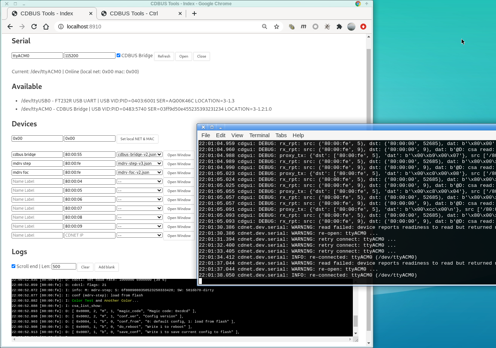
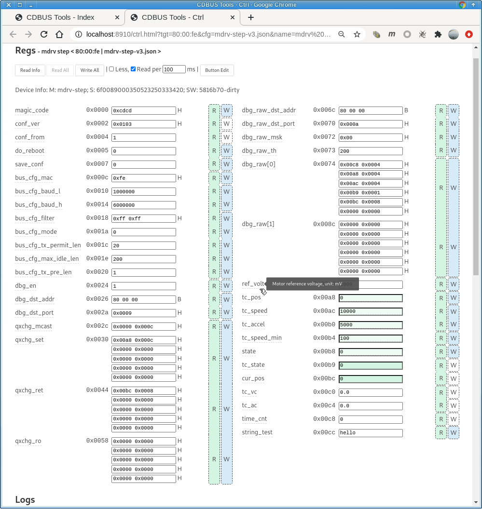
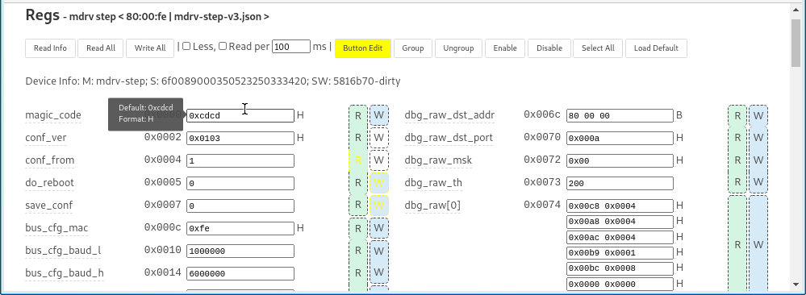
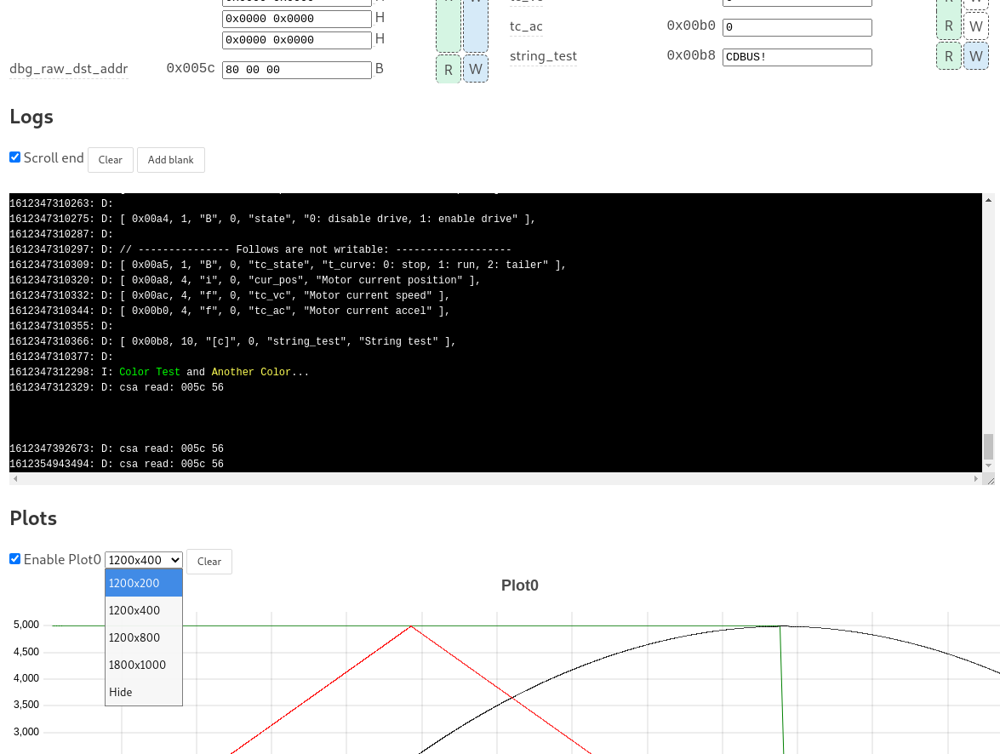
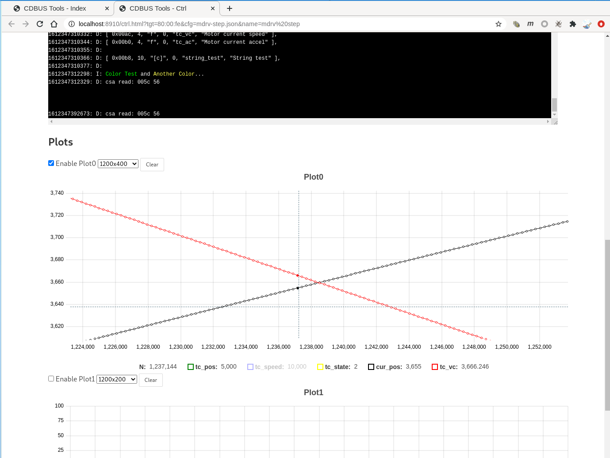
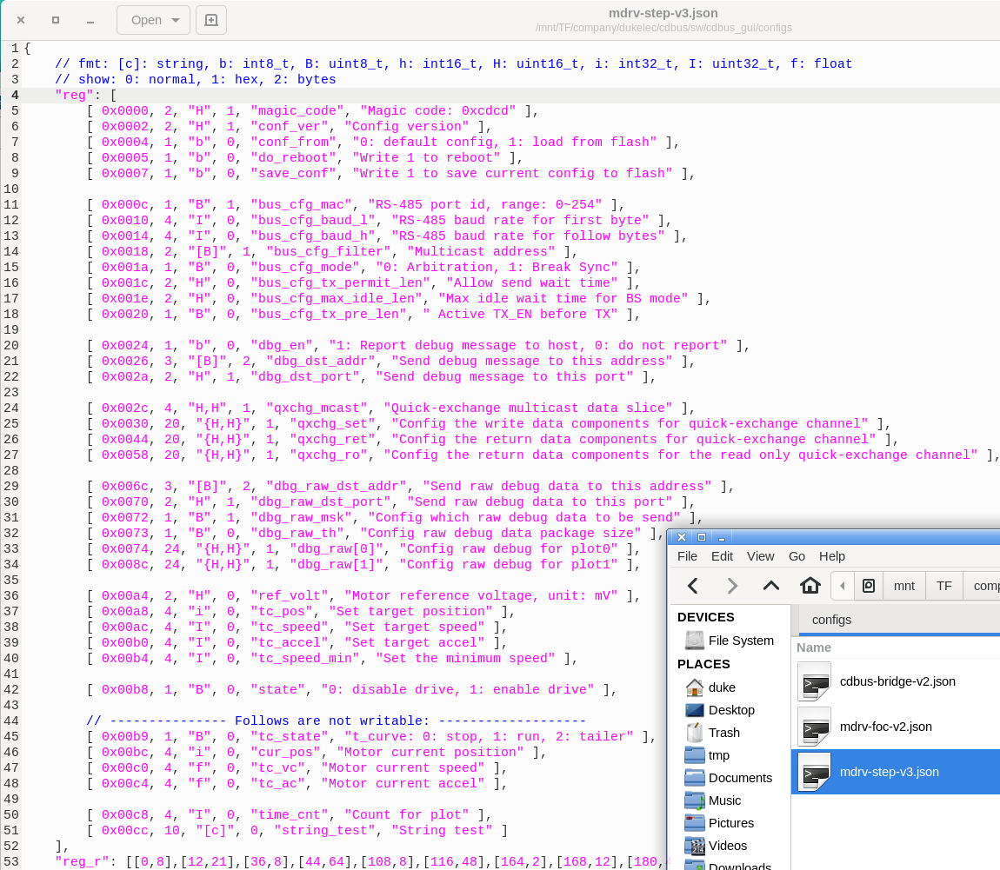
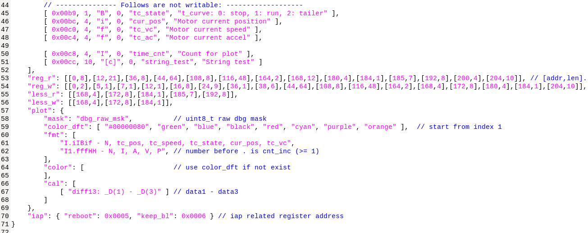
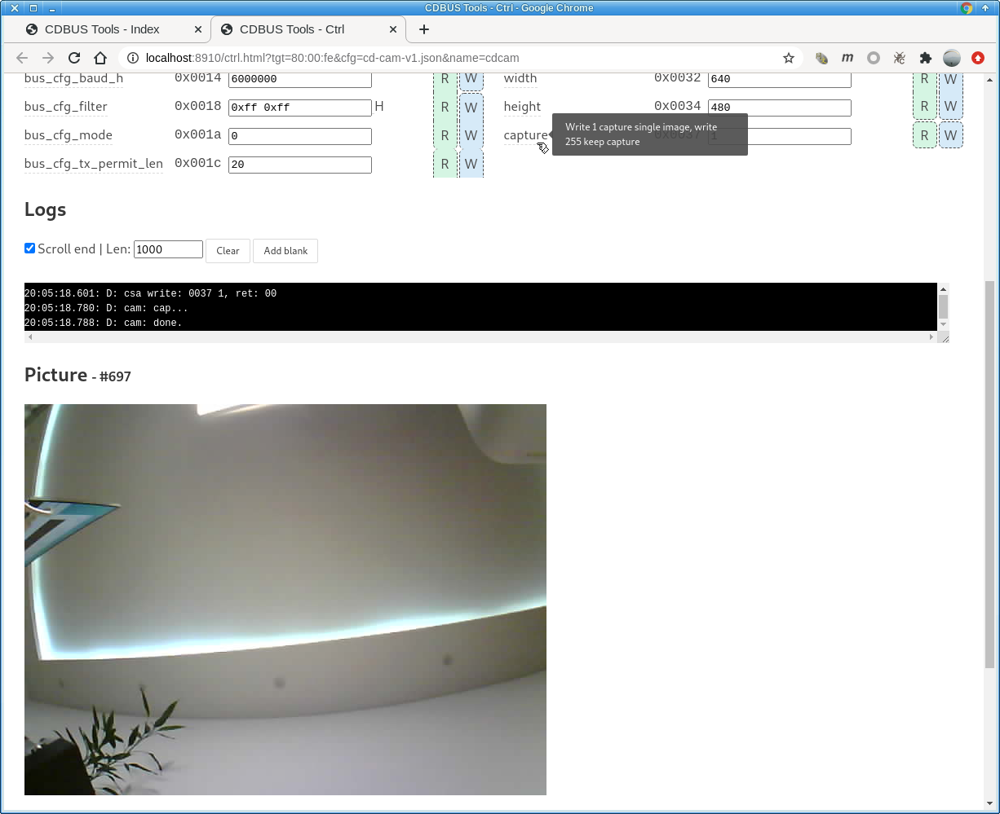

CDBUS GUI Tool
=======================================

#### Let's start by listing one of the features of this tool:
When a master board is controlling a slave, the PC can be hooked up to the same RS-485 bus (CDBUS) and the PC can read and write to the slave, view slave print messages, and view data waveforms without interfering with the control of the slave by the existing master board.


#### Download this project:
`git clone --recurse-submodules https://github.com/dukelec/cdbus_gui.git`

#### Update:
`git pull --recurse-submodules`


#### Dependence:
Python version >= 3.8  
`pip3 install pythoncrc json5 websockets pyserial u-msgpack-python`

#### Usage:
Run `main.py` or `start.sh`, then open url in your web browser: http://localhost:8910

The code architecture is python + web, where python communicates with each web page through a single websocket pipe.  
The web side is bare javascript (vanilla, es6), so you don't need to learn a specific front-end framework to get involved in code editing. It is also convenient to use this app as a template for some product-specific software.  

The protocol between mcu and python is cdnet, currently only the minimal version of the level 1 format is used.  
The protocol between python and the web is similar to cdnet, with arbitrary strings used instead of addresses and ports.  

The firmware on the mcu side of the following demonstration, as well as the usage of cdnet, can be roughly referred to in this project: https://github.com/dukelec/stepper_motor_controller  


### Index Page
 - "Available" lists all the serial ports of your computer, just paste any sub string of them and fill in the first input box of "Serial". The advantage of this is that if the port changes, you can still open the correct serial port. Or you can select the serial port that is plugged into the specified USB port.
 - During use, the serial port will automatically reconnect if it is dropped. On the right is the python background print: successfully reconnected again after unplugging and plugging.
 - "Devices" is mainly to choose which slave to debug, supports debugging multiple devices at the same time, the number of devices is unlimited.
 - "Logs" is the message printed by all devices on the bus, while each device's respective page prints only its own debug message.
 - Printing supports color (ANSI), just like the terminal under Linux, so it is easy to locate errors quickly in many logs.
 - The Logs window can be resized at will.
 - Edited data is automatically saved.

  


### Device Page
The following is the debug window for a specific device, starting with the data list read and write (commonly known as registers).
 - Mouse over the register name and data, it will prompt the register description, and the default data respectively (the default data is also read from the device).
 - The reading and writing of registers is done by group, which can ensure the consistency of a group of data.
 - Groups can be edited at will.
 - Tapping R on a group will read all the data in that group, and W will write a group of data. Tapping Read All and Write All at the top reads and writes each group in turn.
 - The list is configured by the json file of different devices, where the register list is printed out automatically when the device is powered on, just copy and paste it into the json template.
 - Arrays and multiple data formats are supported, and can be set to display in hexadecimal (data box with H flag) or as uint8_t arrays (with B flag).
 - Inside the same group, there are some with a small notch, indicating a hole between two registers. The group is read back before the first write to avoid modifying the data in the hole, which may be empty or any reserved vendor register(s).

  

  

 - This is the Log debug on the Device page, which can also be changed to any size.
 - Further below is the waveform window, which also supports size selection.

  


#### Waveform windows:
 - The value of the currently selected data is indicated below each window, which is convenient and accurate.
 - You can turn on and off a certain curve at will, so it is not easy to mess up when there are many curves. (tc_speed is off in the figure, but the value is still displayed.)
 - The mouse wheel can be used with shift or ctrl to scale the x and y axes respectively, and the default is to scale both axes together.
 - Touch screen zooming is supported, as well as different scaling of x and y axes.
 - Double-click to restore the default diagram (zoom to fit). The middle mouse button is drag and drop (touchpad is also possible).
 - Data depth can be set and old data is automatically deleted to facilitate dynamic data display (oscilloscope effect).
 - The number of waveform windows is not limited.

  

#### The following are IAP and data export and import:
 - IAP supports overall readback validation, device side calculation of crc for validation, and no validation.
 - When the register format is changed, it can be migrated by exporting and importing.
 - Waveform data and log printing will be exported at the same time.

For example, if you are doing motor control, you can ask your customer to send you the waveform he collected for analysis, so as to remotely assist the customer in adjusting PID and other parameters.

  


### JSON Format
Finally, there is the json configuration:
 - The top "reg" is printed out when the device is powered up (it is also automatically generated on the mcu side, so you don't have to fill in the address, size and data type yourself, and it is not error-prone).
 - For easy reading, there are hexadecimal numbers and comments, so the json5 format is used.
 - The "fmt" string with "[]" is an array, which displays all data in one edit box.
 - The ones with "{}" are also arrays, each group occupies one edit box, and each box supports multiple data, which is convenient for struct arrays.

  

 - "reg_r" and "reg_w" are the default register group config, you can left them empty and edit on the UI.
 - The "fmt" of the "plot" data corresponds to two packet formats: "x1 a1 b1 a2 b2 ..." and "x1 a1 b1 x2 a2 b2 ...".
 - The former is an x-axis data shared between multiple groups of data in each packet. The first character "I" of fmt is the format of x, which represents uint32_t, generally a count variable in mcu, with 1 added to each loop and a fixed loop period. The number after "I" represents the delta between x1 and x2, thus recovering x2 x3 ...
 - The latter is the one without a number after "I", where each set of data inside a package has an x value, suitable for scenarios where the loop period changes.

  


### More Info
As a side note, `cdnet ip` is a reference to the concept of ipv6, which facilitates the use of strings to represent different addresses (for efficiency, mcu uses a 3-byte uint8_t array) and is defined as follows.

```
/* CDNET address format:
*
*              local link     unique local    multicast
* level0:       00:NN:MM
* level1:       80:NN:MM        a0:NN:MM       f0:MH:ML
*  `-with seq:  88:NN:MM        a8:NN:MM       f8:MH:ML
* level2:       c0:NN:MM
*  `-with seq:  c8:NN:MM
*
* Notes:
*   NN: net_id, MM: mac_addr, MH+ML: multicast_id
*/
```

 - Broadcast and multicast can also use the "local link" format, there is no need to use the "multicast" format for simple occasions.
 - Generally speaking, it is good to use "80" for simple occasions. And the one starting with "00" is mainly to reduce one or two characters when knocking bare data for testing, which is not recommended for machines.
 - "unique local" is used only when cross-segment, for example, there are multiple network segments, each subnet has multiple devices.
 - level2 is used to transfer other arbitrary data, generally used to transfer the real tcp/ip protocol between multiple computers, group computer networks.

The cdnet ip address can be directly mapped to a standard ipv6 address, so that the computer can interact with mcu through standard udp programming, and the code on the mcu side does not need to change, so the overhead is very small and there is no need to run the ipv6 protocol stack.

